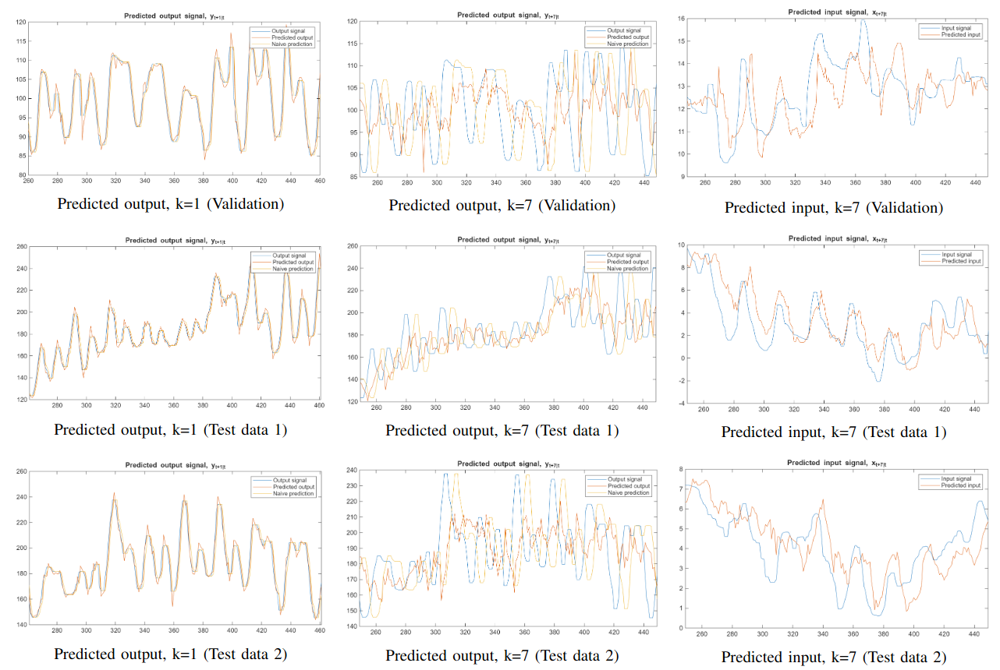

# Denmark Power Forecasting

A MATLAB time-series modelling project for forecasting power from historical power, ambient air temperature, and supply-water temperature observations. It explores seasonal ARMA models, single- and dual-input Box–Jenkins models, and adaptive parameter estimation with a Kalman filter.

The prediction scripts default to a seven-step horizon, corresponding to seven hours where observations are hourly and continuous. They compare forecasts with a persistence baseline and report prediction-error variances. No saved benchmark report establishes forecast accuracy.

## Requirements

- MATLAB with support for string arrays, `fillmissing`, `sgtitle`, and `xline`.
- System Identification Toolbox for `iddata`, `idpoly`, `pem`, `resid`, and model inspection.
- Statistics and Machine Learning Toolbox for diagnostics using `norminv` and `chi2inv`.
- Signal Processing Toolbox for correlation functions such as `xcorr`.

The minimum MATLAB release has not been verified. Saved identification models require compatible MATLAB and toolbox support.

## Example outputs



## Repository layout

| Path | Purpose |
| --- | --- |
| `step1_data_preprocess.m` | Inspect observations, apply a median filter, interpolate selected water-temperature outliers, and save datasets. |
| `step2_ARMA_models.m` | Estimate seasonal ARMA models and inspect residuals. |
| `step3_BJ_models.m` | Estimate separate Box–Jenkins power models using air or water temperature as input. |
| `step4_ARMA_prediction.m` | Forecast power with the air-input Box–Jenkins model and ARMA forecasts of air temperature, despite the filename. |
| `step5_BJ_prediction.m` | Estimate a dual-input Box–Jenkins model, forecast power using both temperatures, and save the fitted model. |
| `step6_Kalman_prediction.m` | Track model parameters with a Kalman filter and generate adaptive forecasts. |
| `src/` | Estimation, polynomial division, correlation plots, statistical diagnostics, and baseline prediction helpers. |
| `data/` | Raw observations, prepared datasets, and fitted models in `.mat` format. |

## Data

`data/projectData25.mat` supplies the `data` matrix used by preprocessing. The scripts interpret its columns as follows:

| Column | Meaning |
| --- | --- |
| 1 | Observation index |
| 2 | Power (forecast target) |
| 3 | Ambient air temperature |
| 4 | Supply-water temperature |
| 5–8 | Year, month, day, and hour |

The original provider, measurement units, and collection location are not documented beyond the Denmark context in the original project description.

Preprocessing selects these inclusive row ranges after median filtering:

| Dataset | Rows | Samples |
| --- | --- | --- |
| Modelling | 1000–2176 | 1177 |
| Validation | 2177–2681 | 505 |
| Test 1 | 2850–3354 | 505 |
| Test 2 | 4496–5000 | 505 |

These are approximately seven weeks for modelling and three weeks for each evaluation set at hourly sampling. Prepared datasets contain `pow_*`, `atemp_*`, and `wtemp_*`, with suffixes `m`, `v`, `t`, and `t2`.

## Running the analysis

Set MATLAB's current folder to the repository root. Each script adds `src/` and `data/` to the MATLAB path using `pwd`, so the current folder matters.

To rebuild the datasets and models, run the scripts in order from the MATLAB Command Window:

```matlab
step1_data_preprocess
step2_ARMA_models
step3_BJ_models
step4_ARMA_prediction
step5_BJ_prediction
step6_Kalman_prediction
```

Review the reproducibility notes below before rebuilding. Steps 1–3 and 5 overwrite corresponding `.mat` artifacts in `data/`. Each script clears workspace variables and closes figures at startup; several later sections also close figures. Run sections interactively in the MATLAB Editor to inspect intermediate diagnostics.

Prepared datasets and models are included, so you can start with `step4_ARMA_prediction` or `step6_Kalman_prediction` to explore saved artifacts. Step 5 re-estimates the dual-input model before predicting.

### Selecting the horizon and evaluation set

Edit `k` and `data_set` in the prediction section of steps 4–6:

```matlab
k = 7;          % Forecast horizon in samples
data_set = 2;   % Validation set
```

| `data_set` | Dataset |
| --- | --- |
| 1 | Modelling |
| 2 | Validation |
| 3 | Test 1 |
| 4 | Test 2 |

Step 4 defaults to the modelling set; steps 5 and 6 default to validation. The Kalman implementation uses fixed lag structures and includes a comment limiting its horizon to `k <= 8`; larger horizons require implementation review.

## Interpreting the output

The scripts plot observed power, model forecasts, and persistence forecasts, alongside temperature forecasts and correlation diagnostics. Step 6 also plots tracked parameters with uncertainty bands.

The Command Window reports:

- Prediction-error variance, `var(ey)`.
- Normalized error variance, `var(ey) / var(y(indV))`.
- The model-to-baseline error-variance ratio, `var(ey) / var_naive`. A ratio below 1 means lower error variance than the persistence baseline on the evaluated samples.

The persistence baseline uses the most recent available power observation as the forecast. These variance measures are not percentage accuracy or RMSE; assess validation and test sets separately from modelling-set results.

## Reproducibility notes

- In the **ARMA Power** section of `step2_ARMA_models.m`, `estimateARMA` receives `atemp_m` rather than `pow_m`. Regenerating `modellpow.mat` therefore fits air temperature under the power-model name. Review this call before interpreting that artifact as a power model.
- Preprocessing notes a timestamp gap in the raw observations but does not restore missing hours. A sample-based horizon may span more elapsed time when it crosses that gap.
- The median filter uses a centred five-sample window over the full series before splitting datasets. Selected modelling-set water-temperature intervals are also interpolated using surrounding values. This offline preprocessing uses future observations, so results do not directly establish live forecasting performance.
- The Kalman script contains hard-coded initial parameters, lag selections, and noise covariances. Model-structure changes require corresponding updates there.
- There is no automated test suite or saved results report. Forecast execution and accuracy must be checked in MATLAB.

## References and licensing

Many helpers in `src/` cite *An Introduction to Time Series Modeling*, 4th edition, by Andreas Jakobsson (Studentlitteratur, 2021). Consult their function headers for usage and attribution.

The repository currently contains no license file or documented dataset reuse terms.
